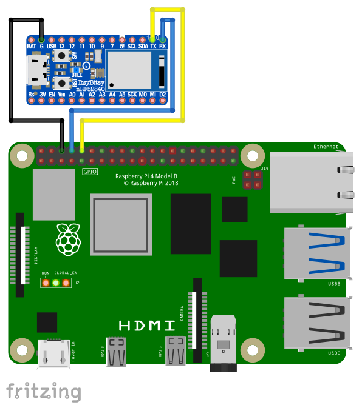

# Multi-Microcontroller Serial Communication

## Overview

Raspberry Pi 4 communicating with an Adafruit ItsyBitsy nRF52840 Express microcontroller via serial UART. This should apply to any two devices with UART capability.

## Connections

* Connect the `Ground` pin from each microcontroller to each other.
* Connect the `TX` pin of one microcontroller to the `RX` pin on the other.
* Connect the `RX` pin of one microcontroller to the `TX` pin on the other.

This way, what one microcontroller transmits on `TX` will be received by the other microcontroller on `RX`.



## Raspberry Pi 4

### Serial Ports

* `/dev/ttyAMA0`, aka `serial1` is used by Bluetooth.
* `/dev/ttyS0`, aka `serial0` is used by the GPIO port (mini UART) on pins `GPIO14` and `GPIO15`.

To enable the serial port, modify the config file:

```sh
sudo nano /boot/config.txt
```

and add (or modify) the following line:

```
enable_uart=1
```

### Disabling the Console

If you are using the serial port for anything except the console, you will need to disable the serial console by issuing two `systemctl` commands and editing another boot config file:

```sh
sudo systemctl stop serial-getty@ttyS0.service
sudo systemctl disable serial-getty@ttyS0.service

sudo nano /boot/cmdline.txt
```

and remove the following from `cmdline.txt`:

```
console=serial0,115200
```

### Dialout Permission

You will need to make sure that your Raspberry Pi user has permissions to "dial out" on the serial port:

```sh
sudo adduser pi dialout
```


## Resources
* https://spellfoundry.com/2016/05/29/configuring-gpio-serial-port-raspbian-jessie-including-pi-3-4/
* https://medium.com/geekculture/serial-connection-between-raspberry-pi-and-raspberry-pico-d6c0ba97c7dc